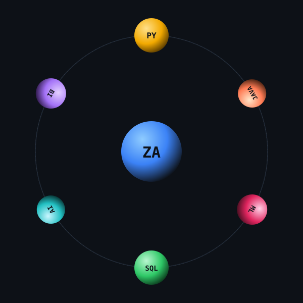
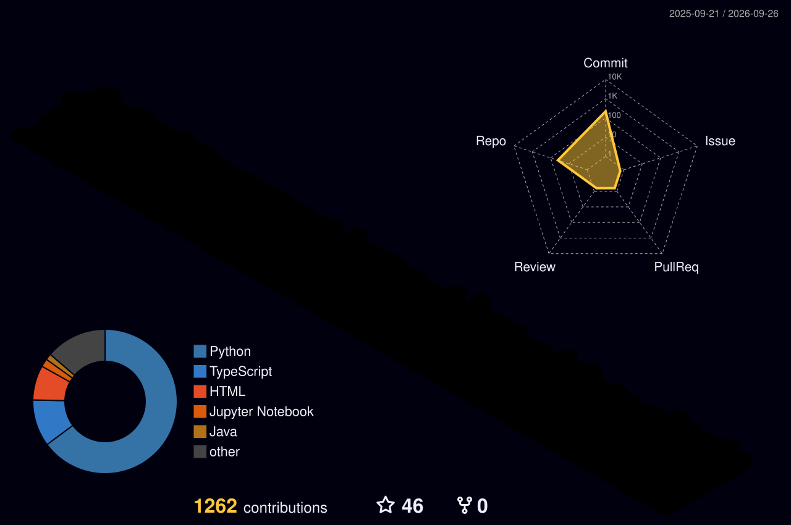

 

  

  
  
  

  &nbsp;
  &nbsp;
  &nbsp;
  &nbsp;
  &nbsp;
  &nbsp;
  

---

## 🧠 Who I Am

I'm a **Software Engineer** first — someone who builds systems that ship, scale, and hold up in production. On top of that core, I specialize across **Agentic AI, Generative AI, Data Science, Data Analytics, and Software Design**, giving me range from writing clean backend architecture to building AI agents to shipping BI dashboards.

Based in **Sopore, Jammu & Kashmir, India**, with real-world experience at **Amazon India, Sure Trust, and Accenture**. Currently open to **full-time roles, internships, and freelance/contract work**.

 

## 🧩 Areas of Expertise

<table width="100%">
<tr>
<td width="20%" align="center">

**👨‍💻** **Software Engineer**
Clean architecture, DSA, system design, scalable backend & full-stack builds

</td>
<td width="20%" align="center">

**🤖** **Agentic AI**
Autonomous agents, tool-use pipelines, LLM orchestration & multi-step reasoning systems

</td>
<td width="20%" align="center">

**✨** **Generative AI**
LLM-powered apps, NLP, prompt engineering, resume/job-matching & content generation

</td>
<td width="20%" align="center">

**📊** **Data Science**
Predictive modeling, EDA, ML pipelines, geospatial & computer vision analytics

</td>
<td width="20%" align="center">

**📈** **Data Analyst**
SQL, Power BI, Tableau, KPI reporting, ETL automation & business intelligence

</td>
</tr>
</table>

+ <b>Software Design</b> — architecting maintainable, well-structured systems across every project above

 

 my core stack, orbiting

 

 

 

## 🛠️ Tech Arsenal

 

**Data Science, ML & Analytics**

       

**Agentic & Generative AI**

   

 

## 💼 Experience

<table>
<tr>
<td width="150"><b>Jun 2026 – Aug 2026</b></td>
<td>
<b>🟠 SDE Intern — Amazon India</b>, Hyderabad 
Built geospatial data pipelines with Python, satellite imagery & ML to study agricultural water resource equity under MGNREGA. Built CV models for object detection/segmentation to geotag agricultural assets. Processed census, satellite & nightlight data into predictive rural-development models across 15 Indian states.
</td>
</tr>
<tr><td colspan="2"> </td></tr>
<tr>
<td><b>Jan 2026 – Jun 2026</b></td>
<td>
<b>🟢 Data Science Intern — Sure Trust</b>, Puttaparthi 
Automated ETL pipelines with Python, Pandas & SQL; ran EDA & statistical analysis for KPI reporting; built an AI resume-screening & job-recommendation system using NLP and ML.
</td>
</tr>
<tr><td colspan="2"> </td></tr>
<tr>
<td><b>Sep 2025 – Dec 2025</b></td>
<td>
<b>🔵 Data Analyst Intern — Accenture</b>, Bengaluru 
Built interactive Power BI dashboards & KPI reports; automated data-cleaning workflows; supported predictive analytics & fraud-detection initiatives.
</td>
</tr>
<tr><td colspan="2"> </td></tr>
<tr>
<td><b>Jun 2025 – Jul 2025</b></td>
<td>
<b>🟡 Trainee, Java & Python — Ducat Education</b> (45-day training)
</td>
</tr>
</table>

 

## 🚀 Featured Projects

> Update each link once pushed to match your real repo names.

| Project | What it does |
|---|---|
| 🎯 [AI Career Growth Engine](https://github.com/ZahikAbasdar/AI-Career-Growth-Engine) · [Live Demo](https://your-live-demo-link.com) | AI resume scoring, skill extraction & career recommendations |
| 🛰️ [Satellite Socioeconomic Intelligence](https://github.com/ZahikAbasdar/Satellite-Socioeconomic-Intelligence) | Geospatial analytics across 100+ regions, 44 Indian cities, 14K+ samples |
| 🔍 [AI Data Analysis Agent](https://github.com/ZahikAbasdar/AI-Data-Analysis-Agent) | Natural language → SQL insights & automated reporting |
| 📈 [Data Intelligence & Predictive Analytics AI](https://github.com/ZahikAbasdar/Data-Intelligence-and-Predictive-Analytics-AI) | Full-stack React/Supabase/PostgreSQL predictive analytics platform |
| 💹 [AI Customer Growth Engine](https://github.com/ZahikAbasdar/AI-Customer-Growth-Engine) | Churn prediction, segmentation & retention dashboards |

 

## 📊 GitHub Stats & 3D Contribution Graph

  

### 🐍 Contribution Snake

  

 

## 🧩 LeetCode & DSA

  

| Platform | Status |
|---|---|
| 🟠 [LeetCode](https://leetcode.com/u/ZahikAbas/) | 700+ combined problems solved |
| 🟢 [GeeksforGeeks](https://www.geeksforgeeks.org/profile/user_f3f23u0irh7) | Active practitioner |
| 💎 CodinGame | Diamond Badge |

 

## 🏆 Achievements

- 🥇 1st Position, **Punjab State Chess Championship**
- 🥇 Gold Medal, Group Discussion — University of Kashmir (Allama Iqbal House)
- 🥇 Gold Medals — Volleyball, Basketball, Cricket, Football & Chess
- 💎 Diamond Badge on **CodinGame**
- ☁️ **48 Google Cloud Skill Badges** — AI, Cloud Computing, Data Analytics, Generative AI
- 🧩 700+ DSA & SQL problems solved (LeetCode, HackerRank, GeeksforGeeks)
- 🚀 ICEL, Tata Imagination Challenge, Shark Tank Pitching Wars, Ops Think Tank, QuizVerse & 10+ hackathons

 

## 📜 Certifications

 

## 🔬 Publications & Research

**Predict, Protect & Observe** · Jun 2026 – Aug 2026
Research Team: Zahik Abas, Suman, Harsh, Sumit Kumar — geospatial intelligence framework using NASA satellite imagery, remote sensing, and deep learning for environmental monitoring and predictive decision support, backed by a literature review of 15+ peer-reviewed publications.

 

## 🎓 Education

**B.Tech, Computer Science & Engineering** — PCTE Group of Institutes, Ludhiana *(Pursuing)*
12th — Govt Boys HSS, Sopore — 2021 — 80% · 10th — Public HSS, Sopore — 2019 — 85%

 

## 📬 Let's Connect

| | |
|---|---|
|  Email | [zahikabas.btec@gmail.com](mailto:zahikabas.btec@gmail.com) |
|  LinkedIn | [linkedin.com/in/zahik-abas-2646572a4](https://www.linkedin.com/in/zahik-abas-2646572a4/) |
|  Portfolio | [personal-pt-react-threejs.vercel.app](https://personal-pt-react-threejs.vercel.app/) |
|  Medium | [medium.com/@zahikabas.btec](https://medium.com/@zahikabas.btec) |
|  LeetCode | [leetcode.com/u/ZahikAbas](https://leetcode.com/u/ZahikAbas/) |
|  GeeksforGeeks | [geeksforgeeks.org profile](https://www.geeksforgeeks.org/profile/user_f3f23u0irh7) |
|  GitHub | [github.com/ZahikAbasdar](https://github.com/ZahikAbasdar) |

 

*Available for full-time roles, internships, and freelance data/ML work.*

